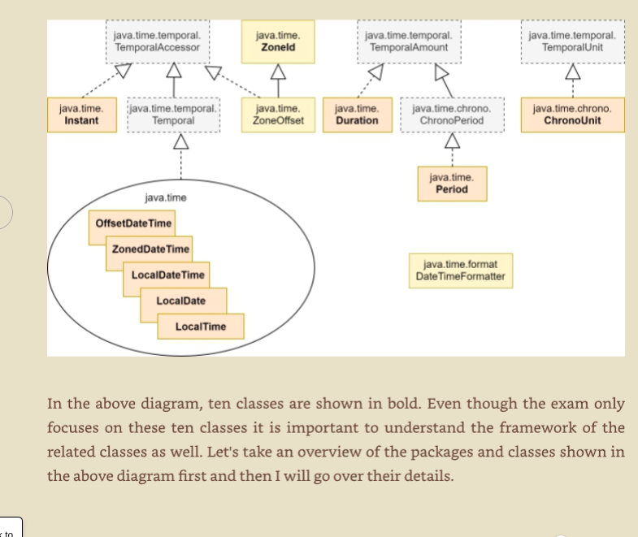

## The Evolution of Time in Java

When Java 8 dropped, it introduced a completely fresh take on managing date and time. This wasn't just an upgrade; it was a total rewrite with zero dependencies on the legacy `java.util.Date` or `java.util.Calendar` classes.

Why the clean slate? Because Java's first two attempts failed hard. Both legacy classes were mutable, notoriously difficult to work with, non-thread-safe, and caused endless debugging nightmares for developers.

### Humans vs. Machines: The Core Complexity

The root problem with handling time in software is that computers and humans see it through entirely different lenses:

* **For Humans:** Time is context-dependent. It's a structured set of human-defined numbers (years, months, hours) based on where we are standing on Earth. Your 4:00 PM might mean tea time.
* **For Machines:** Time is linear and absolute. A computer doesn't care about time zones or tea; it views time simply as a continuous line measuring the period that has elapsed since a predefined starting point.

### The Epoch and UTC

This universal starting point is called the **Epoch**.

* **The Anchor:** It is set precisely at **January 1, 1970, 00:00:00.000 UTC**.
* **The Reference:** Coordinated Universal Time (UTC) serves as the global, immutable reference clock (historically tied to Greenwich Mean Time or GMT).

To a computer, "now" isn't a date string—it's just a massive number representing every single millisecond (or nanosecond) that has ticked forward on the axis since that 1970 anchor point.

### Enter `java.time`

Because of this fundamental gap between human context and machine ticks, the entire architecture had to be redesigned under the modern `java.time` package.

The diagram below outlines the core interfaces and classes built to handle both sides of this equation smoothly, which we will dive into next.

- The java.time package 
    - Instant :     
        - this class represents the computers view of time 
    - LocalDate/LocalTime/LocalDateTime 
        - as the name explains these are just a date,time and dateand time wihtout indication of the place for which that date/time is applcicale 
        - the location is measing.. for example your firend living in Sinapore tell you lets meet on a coffee at 9pm tommorw you dont know when and where actaully youll have to meet him right? 
    - ZoneId: came into peture to determine the date and time of a day with respect to its UTC 
        this enabled us to take a point on the machine timeline (( an instant )) and determin eth exact date and time in a regiion 
        -   the rules and logic is hard to dind inside this library itself because its treated as an Id the actuall rules are instide the JDK 
        ZoneRuleclass... 
        - ZoneId
            -> <area>/<city>
                example : ZoneId.of("Asia/Calcuta")
                the string you enter mustch match an official timezone in the JDKs database or be in a format that correctly specifies and "oggset" amound such as UTC+0:12,
            - trying to create a nonExistencial zone will give an ZoneRulesException exception 
    - ZonedDateTime
        - as sname suggests it explaing the date and time in a particular timezone 
            - so we need an Instanst + zoneId ((this brings the rules)) 
    - OffsetDateTime 
        - kindof weird one ... neither it represents a local datetime nor deos it represents a datetime in any perticular georaphical region 
        - its having 2 parts 
            - offset by which it defferes from the actuall UTC + instance of Epoch 
            - how do we create time 
                ZoneOffset zo = ZO.ofHoursMinutes(1,21);
                -> "UTC+01:10" 

    - Period 
        - represents a date-based amount of time in terms of days,months,and years
        - no mention of hours minutes and seconds 
    - Duration 
        - time-based amount in HoursMinutesseconds.. no notion of Days,Months,years 
    ** note - Period Vs Duration 
        - 1 day Period ~ 24 hour duration 
        - a date + 1 day perid -> increatemnt the date compoentne only 
        - a date + 24 hours duration -> changes both duration and peroid 
        - this package also has Enums : 
            Months & daysofweek (monday -> Sundat)..use of these will increate the readability 
            example : LocalDate.of(2024,Month.January,10) is more readable than LocalDate.of(2024,1,10)

    - temooral package 
        - tempporalmTemporalAMount,temporalUnit,TemporalFirld and 
        - i didnt udnerstood explain better 
            - implemented by various classes of the java.time package. Having common base interfaces for related classes allows applications to operate on the classes uniformly. For example, you can add a Period to a LocalDate in the same way as you add a Duration to a ZonedDateTime , i.e., by calling the addTo method on a Period or a Duration instance or by calling the plus method on a LocalDate or a ZonedDateTime instance. This is possible because both Period and Duration implement TemporalAmount, which declares the addTo(Temporal t) method and both LocalDate and ZonedDateTime implement Temporal
            the interfaces of this package. Many of the methods that you will use while working with date/time classes are actually declared in the interfaces of this package. The ChronoUnit enum of this package is particularly useful as it implements TemporalUnit and defines a standard set of units of date/time such as DAYS, MONTHS, YEARS, HOURS, MINUTES, SECONDS, NANOS, and WEEKS. These units are used while manipulating and creating date and time objects. ChronoUnit also overrides the long between(Temporal temporal1Inclusive, Temporal temporal2Exclusive)method of TemporalUnit, which is used often to calculate the difference between two date/time values in terms of the unit defined by the ChronoUnit instance.
    - time.format package 
        - helpers 
        - for converitng date/time objects to string and parsing aswellas dateTimeFormatter ad formatStyle 
        - no method to update though ? 
            why : immutables 

## Creating Date and / Time Objects 
- no public constructor so no new keyword
- so how do we create these 
    - public static factory 
        - named now of from 
            - now Methods 
                - now 
                     - gives current date or time in the time line that the class is meant to represent
                     - LocalDateTime.now() current instance of time in my PC 
                     - LocalDate.now()
                     - LocalTime.now()
                        - Similarly OffsetDateTimee()
                        ZonedDateTime
                    
                - of Methods 
                    - we can create an object for any date or time by passing individual components of a date/time 

                        
    - public instance methods 
        - with and truncatedTo 
    
    